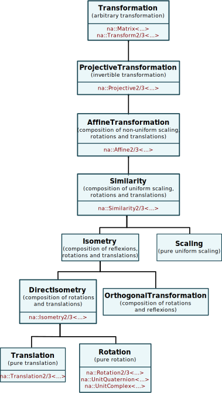

# Generic programming

**nalgebra** allows several kind of generic programming, either through traits
of the **alga** crate, or by keeping the various type parameters of the
`Matrix<N, R, C, S>` structure and the likes. In the end, this allows for:

* <u>**Genericity wrt. scalars**</u>: the most common kind of abstraction.
  This allows you to write code that will work on any scalar group like `i32`
  and fields like `f32` or `f64`.

* <u>**Dimensional genericity**</u>: allows you to write code that will work
  generically for 2D, 3D, and higher dimensions.

* <u>**Transformation genericity**</u>: Some transformations may have several
  representations. For example,
  3D rotations can either be expressed as 3x3 matrices with `Rotation3` or as
  unit quaternions with `UnitQuaternion`. Both have their advantages and
  downsides depending on the applications. Thus it can be useful to write
  algorithms that are independent from the user's choice of representation for
  the same transformation. Moreover, this abstraction allows you to use simpler
  transformation (e.g. a pure rotation) where a more complex one is accepted
  (e.g. an isometry). This can be allowed because some transformation groups
  are sub-groups of others. For example, the group of rotations
  $SO(n)$ is a subgroup of the direct isometry group $SE(n)$.


## Genericity wrt. scalars
This allows to write code that works with algebraic entities constructed on top
of a generic scalar type, e.g., floating-point numbers like `f32` or `f64` and
in some more restrictive cases integers like `i32` or `u64`.  This can be
achieved by keeping generic the first type parameter `N` of any structure of
**nalgebra** (including aliases). The mandatory trait bound of `N` is
`na::Scalar` which imposes some simple non-mathematical properties, i.e., `N`
must copyable, printable (using the `{:?}` [format
string](https://doc.rust-lang.org/std/fmt/index.html#formatting-traits)), and
comparable using the equality operator. Other commonly used trait bounds for
`N` are `general::RingCommutative` or `general::Real` from the
[alga](https://docs.rs/alga/0.4.0/alga/general/trait.Real.html) crate. This
enables operator overloading and useful mathematical functions for signed
integers and floating point numbers respectively. Note that the `Scalar` trait
bound does not have to be specified if `Real` already is.

<ul class="nav nav-tabs">
  <li class="active"><a id="tab_nav_link" data-toggle="tab" href="#scalar_genericity">Example</a></li>

  <div class="btn-primary" onclick="window.open('https://raw.githubusercontent.com/sebcrozet/nalgebra/master/examples/scalar_genericity.rs')"></div>
</ul>

<div class="tab-content" markdown="1">
  <div id="scalar_genericity" class="tab-pane in active">
```rust
use alga::general::{RingCommutative, Real};
use na::{Vector3, Scalar};

fn print_vector<N: Scalar>(m: &Vector3<N>) {
  println!("{:?}", m)
}

fn print_squared_norm<N: Scalar + RingCommutative>(v: &Vector3<N>) {
  // NOTE: alternatively, nalgebra already defines `v.squared_norm()`.
  let sqnorm = v.dot(v);
  println!("{:?}", sqnorm);
}

fn print_norm<N: Real>(v: &Vector3<N>) {
  // NOTE: alternatively, nalgebra already defines `v.norm()`.
  let norm = v.dot(v).sqrt();

  // The Real bound implies that N is Display so we can
  // use "{}" instead of "{:?}" for the format string.
  println!("{}", norm)
}

fn main() {
  let v1 = Vector3::new(1, 2, 3);
  let v2 = Vector3::new(1.0, 2.0, 3.0);

  print_vector(&v1);
  print_squared_norm(&v1);
  print_norm(&v2);
}
```
  </div>
</div>

## Dimensional-genericity
Many algorithms work for an arbitrary number of dimensions. In those cases,
there is often no point in writing a specific version for each dimension of
interest because given the proper abstract mechanisms they all are equivalent
(even performance-wise). Of course some algorithms (like [convex
hull](https://en.wikipedia.org/wiki/Convex_hull) computation) still require
dedicated implementations for 2D and 3D to be efficient in which case the user
may still retrieve the arguments' dimension number with `na::dimension::<V>()`
(where `V` is a vector type) to select specific implementations at runtime.
Because both `V` and the result of `na::dimension` are known at compile-time,
testing and the corresponding branching will usually be optimized away by the
compiler.  There are two ways of obtain this kind of abstraction in
**nalgebra**:

1. **Algebraic genericity**: the simplest and recommended method is to
   parametrize the generic algorithms with regard to the algebraic data type,
   i.e., the vector, matrix, transformation type, etc. This is based on the
   traits of the `linear` module of the **alga** crate. This method can be used
   only with algebraic entities with dimensions known at compile-time.  This
   also gives you access to a rich set of features like vector space basis
   elements indexing, Gram-Schmidt orthogonalization, generic transformations,
   etc.
2. **Structural genericity**: the less flexible way is to parametrize the
   algebraic structures themselves by the dimension number, for example, by
   keeping generic the number of rows `R` and columns `C` of the `Matrix<N, R,
   C, S>` type. Doing so is feasible but cumbersome as the data storage
   parameter must be generic as well because its type usually depends on the
   number of elements it has to contain (especially for stack-allocated
   algebraic structures). In some cases, because of some limitations of the
   rust compiler, even the data storage allocator associated type `S::Alloc`
   has to be constrained as well. See the section about [implementation
   internals](#implementation-internals) for more details about the
   specification of data storage structures and their allocators.

<ul class="nav nav-tabs">
  <li class="active"><a id="tab_nav_link" data-toggle="tab" href="#with_algebraic_genericity">With algebraic genericity</a></li>
  <li><a id="tab_nav_link" data-toggle="tab" href="#with_dim_genericity">With structural genericity</a></li>
  <li><a id="tab_nav_link" data-toggle="tab" href="#without_dim_genericity">Without dimensional genericity</a></li>

  <div class="btn-primary" onclick="window.open('https://raw.githubusercontent.com/sebcrozet/nalgebra/master/examples/dimensional_genericity.rs')"></div>
</ul>

<div class="tab-content" markdown="1">
  <div id="with_algebraic_genericity" class="tab-pane in active">
```rust
/// Reflects a vector wrt. the hyperplane with normal `plane_normal`.
fn reflect_wrt_hyperplane<V>(plane_normal: &Unit<V>, vector: &V) -> V
    where V: FiniteDimInnerSpace + Copy {
    let n = plane_normal.as_ref(); // Get the underlying vector of type `V`.
    *vector - *n * (n.dot(vector) * na::convert(2.0))
}

fn main() {
    let plane2 = Vector2::y_axis(); // 2D plane normal.
    let plane3 = Vector3::y_axis(); // 3D plane normal.

    let v2 = Vector2::new(1.0, 2.0);      // 2D vector to be reflected.
    let v3 = Vector3::new(1.0, 2.0, 3.0); // 3D vector to be reflected.

    // Call the generic function twice.
    let refl_v2 = reflect_wrt_hyperplane(&plane2, &v2);
    let refl_v3 = reflect_wrt_hyperplane(&plane3, &v3);

    assert!(refl_v2.y == -2.0);
    assert!(refl_v3.y == -2.0);
}
```
  </div>

  <div id="with_dim_genericity" class="tab-pane">
```rust
/// Reflects a vector wrt. the hyperplane with normal `plane_normal`.
fn reflect_wrt_hyperplane<N, D, S>(plane_normal: &Unit<ColumnVector<N, D, S>>,
                                   vector:       &ColumnVector<N, D, S>)
                                   -> OwnedColumnVector<N, D, S::Alloc>
    where N: Real,
          D: DimName,
          S: Storage<N, D, U1> {
    let n = plane_normal.as_ref(); // Get the underlying V.
    vector - n * (n.dot(vector) * na::convert(2.0))
}

fn main() {
    let plane2 = Vector2::y_axis(); // 2D plane normal.
    let plane3 = Vector3::y_axis(); // 3D plane normal.

    let v2 = Vector2::new(1.0, 2.0);      // 2D vector to be reflected.
    let v3 = Vector3::new(1.0, 2.0, 3.0); // 3D vector to be reflected.

    // Call the generic function twice.
    let refl_v2 = reflect_wrt_hyperplane(&plane2, &v2);
    let refl_v3 = reflect_wrt_hyperplane(&plane3, &v3);

    assert!(refl_v2.y == -2.0);
    assert!(refl_v3.y == -2.0);
}
```
  </div>

  <div id="without_dim_genericity" class="tab-pane">
```rust
/// Reflects a 2D vector wrt. the 2D line with normal `plane_normal`.
fn reflect_wrt_hyperplane2<N>(plane_normal: &Unit<Vector2<N>>,
                              vector:       &Vector2<N>)
                              -> Vector2<N>
    where N: Real {
    let n = plane_normal.as_ref(); // Get the underlying Vector2
    vector - n * (n.dot(vector) * na::convert(2.0))
}

/// Reflects a 3D vector wrt. the 3D plane with normal `plane_normal`.
/// /!\ This is an exact replicate of `reflect_wrt_hyperplane2, but for 3D.
fn reflect_wrt_hyperplane3<N>(plane_normal: &Unit<Vector3<N>>,
                              vector:       &Vector3<N>)
                              -> Vector3<N>
    where N: Real {
    let n = plane_normal.as_ref(); // Get the underlying Vector3
    vector - n * (n.dot(vector) * na::convert(2.0))
}

fn main() {
    let plane2 = Vector2::y_axis(); // 2D plane normal.
    let plane3 = Vector3::y_axis(); // 3D plane normal.

    let v2 = Vector2::new(1.0, 2.0);      // 2D vector to be reflected.
    let v3 = Vector3::new(1.0, 2.0, 3.0); // 3D vector to be reflected.

    // Call each specific implementation depending on the dimension.
    let refl_v2 = reflect_wrt_hyperplane2(&plane2, &v2);
    let refl_v3 = reflect_wrt_hyperplane3(&plane3, &v3);

    assert!(refl_v2.y == -2.0);
    assert!(refl_v3.y == -2.0);
}
```
  </div>
</div>

## Transformation-genericity

If an algorithm works with elements of a given algebraic structure, it is
usually expected to work with any element of its sub-structures as well. In
particular, an algorithm that can be given as input elements of the group
$(\mathbf{G}, \cdot)$, where $\cdot$ is the group operator, will still work
if we feed it with elements of $(\mathbf{H}, \cdot)$, where $\mathbf{H} \subset
\mathbf{G}$ has the subgroup structure. For transformations types, this
"subgroup" relationship is encoded by trait inheritance in **alga** (the
subgroups inherits from the larger group).

For example, it makes sense for an algorithm that takes an `Isometry3` in input
to keep working if it is given a `Rotation3` instead: rotations are just
special cases of isometries with a translation equal to zero. However, the
converse is not true: if an algorithm is designed to work only with pure
rotations, it has little chances to keep working if we add translations as
well.

The following figure shows the transformation trait hierarchy defined on the
`linear` module of the **alga** crate. The corresponding data structures that
implement them on **nalgebra** are shown in red. Note that despite the fact
that **alga** designates an isometry as the composition of a reflexion,
rotation, and a translation, the `Isometry2/3` type of **nalgebra** does not
include the reflexion part, i.e., it is actually a _direct_ isometry.

<center>

</center>

Finally, note that the special data structure `Id` (not shown in the previous
figure for clarity) is defined as a subgroup (with contains the identity
element only) of every transformation group in **alga**. That's why the
Identity type [performance trick](../performance_tricks/#the-id-type)
actually works and is mathematically sound.

# Implementation internals

<i>
<br/>
<center>
<big>
**This section is still Work-in-Progress.**
</big>
</center>
<br/>
</i>

<!--

This section details how the allocation and data storage system work on
**nalgebra**. This can be safely skipped by the occasional user of the library
but might interest those that want to contribute, write code generic wrt. the
data storage type, and get a better understanding of some compilation errors.
Almost all data structure defined by **nalgebra** take a type parameter named
`S`. This stands for **s**torage buffer, i.e. the buffer that contains any
run-time data necessary to find the matrix size and elements. Each data storage
is associated at the type-level to an allocator type that can be retrieved as
an associated type of the `Storage` trait. This allocator is responsible for
creating other algebraic structures. It may or may not perform dynamic
allocations.

## Storage buffers
Storage buffers defined in **nalgebra** are:


Type                   | Description
-----------------------|------------
`MatrixVec<N, R, C>`   | Dynamically-allocated buffer. Will still perform a dynamic allocation if `R` and `C` are both type-level integers. |
`MatrixArray<N, R, C>` | Statically-allocated buffer. `R` and `C` cannot be equal to `Dynamic`. |
`SliceStorage<...>`    | Metadatas and reference to parts of another data storage.              |
`SliceStorageMut<...>` | Metadatas and mutable reference to parts of another data storage.      |


Trait                   | Description
------------------------|------------
`Storage<N, R, C>`      | A storage that provides non-mutable access to the matrix components. The storage structure itself does not have to own its data, i.e., it can contain only a reference as does the `SliceStorage`. |
`StorageMut<N, R, C>`   | A storage that provides mutable access to the matrix components. The storage structure itself does not have to own its data, i.e., it can contain only a mutable reference as does the `SliceStorageMut`. |
`OwnedStorage<N, R, C>` | A storage that provides mutable access to the matrix components and that owns its data. The storage structure itself has to contain all the matrix components in a contiguous, column-major, array in memomy. |

## Allocators
-->
