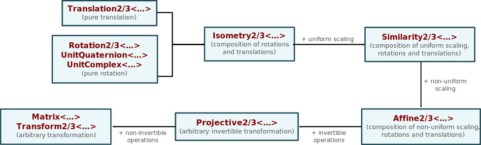

# Points


Just like vectors, points defined in **nalgebra** are elements of $\mathbb{R}^n$
However, they both have different uses, depending on your application.

<u>**In a very general context**:</u> vectors are what you choose when you need
a _bag of coordinates_ (relative to a suitable basis). Points will not be
useful for you as they support much less operations than vectors. Vectors
support most common operations like cross product, dot product, componentwise
binary operations, etc. Simply search for the name of the operation you want on
the root module [documentation](rustdoc_nalgebra) or the [quick
reference](../quick_reference) and it will likely be listed as a free
function or a method. If you can't find what you need, feel free to open an
[issue](https://github.com/sebcrozet/nalgebra/issues) or ask about it on the
[user forum](http://users.nphysics.org/c/nalgebra).


<u>**In a geometric context**:</u> a point is an element of an euclidean space,
while a vector is an element of the underlying vector space. In other words, a
point is a location in space while a vector is a translation, i.e., the
displacement required to move from one point to another:

<center>

</center>

Intuition can often be safely used to anticipate which operations are or are
not allowed between points, and what is the relation between a vector and a
point. In particular:

* A point's coordinates vector can be accessed as a public field: `p.coords`.
* The sum of a point $a$ with a vector $v$ returns another point which is the
  translation of $a$ by the vector $v$.
* The difference of two point $b$ and $a$ returns the vector $\vec{ab}$ such
  that $b = a + \vec{ab}$.
* The sum, multiplication and division of two points are meaningless and not
  supported by **nalgebra**.
* For convenience, you may compute the center of two points using the
  free function `na::center(a, b)`.
* The [homogeneous
  coordinates](#homogeneous-coordinates) of a point
  usually end with a `1` while those of a vector always ends with a `0`.
* Points are affected by the translational component of
  [transformations](#transformations) while vectors are only rotated and
  scaled:

<ul class="nav nav-tabs">
  <li class="active"><a id="tab_nav_link" data-toggle="tab" href="#transform_vector_point">Example</a></li>

  <div class="btn-primary" onclick="window.open('https://raw.githubusercontent.com/sebcrozet/nalgebra/master/examples/transform_vector_point.rs')"></div>
</ul>

<div class="tab-content" markdown="1">
  <div id="transform_vector_point" class="tab-pane in active">
```rust
let t = Isometry2::new(Vector2::new(1.0, 1.0), f32::consts::PI);
let p = Point2::new(1.0, 0.0); // Will be affected by te rotation and the translation.
let v = Vector2::x();          // Will *not* be affected by the translation.

assert_relative_eq!(t * p, Point2::new(-1.0 + 1.0, 1.0));
//                                     ^^^^ │ ^^^^^^^^
//                                  rotated │ translated

assert_relative_eq!(t * v, Vector2::new(-1.0, 0.0));
//                                      ^^^^^
//                                   rotated only
```
  </div>
</div>

Points can be created with various constructors:

Constructor                 | Effect
----------------------------|-----------
`::origin()`                | Builds the point with all its coordinates set to zero.
`::from_coordinates(v)`     | Builds the point with coordinates vector equal to `v`.
`::from_homogeneous(v)`     | Builds a point with the given [homogeneous coordinates](#homogeneous-coordinates), i.e., with all its components divided by the last one (which is then removed).
`::new(x, y, ...)`          | Builds the point with the given coordinates. Works only for points with a dimension known at compile-time and smaller than 6. |
`Bounded::max_value()`      | Builds the point with all its coordinates set to the maximal value of the underlying scalar type.
`Bounded::min_value()`      | Builds the point with all its coordinates set to the minimal value of the underlying scalar type.

<ul class="nav nav-tabs">
  <li class="active"><a id="tab_nav_link" data-toggle="tab" href="#point_construction">Example</a></li>

  <div class="btn-primary" onclick="window.open('https://raw.githubusercontent.com/sebcrozet/nalgebra/master/examples/point_construction.rs')"></div>
</ul>

<div class="tab-content" markdown="1">
  <div id="point_construction" class="tab-pane in active">
```rust
// Build using components directly.
let p0 = Point3::new(2.0, 3.0, 4.0);

// Build from a coordinates vector.
let coords = Vector3::new(2.0, 3.0, 4.0);
let p1 = Point3::from_coordinates(coords);

// Build by translating the origin.
let translation = Vector3::new(2.0, 3.0, 4.0);
let p2 = Point3::origin() + translation;

// Build from homogeneous coordinates. The last component of the
// vector will be removed and all other components divided by 10.0.
let homogeneous_coords = Vector4::new(20.0, 30.0, 40.0, 10.0);
let p3 = Point3::from_homogeneous(homogeneous_coords);

assert_eq!(p0, p1);
assert_eq!(p0, p2);
assert_eq!(p0, p3);
```
  </div>
</div>


# Transformations

Transformations are algebraic entities that act on points and vectors to change
their coordinates. The following figure shows the whole spectrum of
transformations supported by dedicated types on **nalgebra** (notations like
`Affine2/3` means either `Affine2` or `Affine3`):

<center>

</center>

All the types shown in this diagram are actually type aliases for types generic
wrt. the dimension and with a name ending with `Base` instead of a number,
i.e., the base implementation of the translation is `TranslationBase`. The more
general transformations `Transform2/3`, `Projective2/3`, and `Affine2/3` are
aliases for the parametrized type `TransformBase<..., Category>` where its last
type parameter `Category` specifies which of the three variants is represented.
Note that raw matrices can also be interpreted as general transformations that
are not necessarily invertible. This may be useful in a [generic
context](../generic_programming/#transformation-genericity).

Transformations can be composed (by multiplication) even if they do not have
the same type. The type of the composition result is the most general
transformation of both. For example, multiplying a `Projective3` (inversible
transformation) with a `Similarity3` yields a `Projective3` because all
similarities are inversible. An exception is the product of any pure rotation
by a pure translation: none is more general than the other so the result is an
`Isometry2/3` which is the most specific transformation enough to represent
this composition.


Converting a transformation to one that is more general is possible with the
`na::convert(...)` function. The other way round is sometimes possible using
`na::try_convert(...)` which returns a non-`None` value in case of success. For
example, converting a `Similarity2` to an `Isometry2` will succeed only if the
similarity scaling factor is one (which is checked at run-time by
`::try_convert(...)`). Note that if you do not which to consume your input
value upon conversion, use `na::convert_ref(...)` and
`na::try_convert_ref(...)` with references instead.


<ul class="nav nav-tabs">
  <li class="active"><a id="tab_nav_link" data-toggle="tab" href="#transform_conversion">Example</a></li>

  <div class="btn-primary" onclick="window.open('https://raw.githubusercontent.com/sebcrozet/nalgebra/master/examples/transform_conversion.rs')"></div>
</ul>

<div class="tab-content" markdown="1">
  <div id="transform_conversion" class="tab-pane in active">
```rust
// Isometry -> Similarity conversion always succeeds.
let iso = Isometry2::new(Vector2::new(1.0f32, 2.0), na::zero());
let _: Similarity2<f32> = na::convert(iso);

// Similarity -> Isometry conversion fails if the scaling factor is not 1.0.
let sim_without_scaling = Similarity2::new(Vector2::new(1.0f32, 2.0), 3.14, 1.0);
let sim_with_scaling    = Similarity2::new(Vector2::new(1.0f32, 2.0), 3.14, 2.0);

let iso_success: Option<Isometry2<f32>> = na::try_convert(sim_without_scaling);
let iso_fail:    Option<Isometry2<f32>> = na::try_convert(sim_with_scaling);

assert!(iso_success.is_some());
assert!(iso_fail.is_none());

// Similarity -> Isometry conversion can be forced at your own risks.
let iso_forced: Isometry2<f32> = unsafe { na::convert_unchecked(sim_with_scaling) };
assert_eq!(iso_success.unwrap(), iso_forced);
```
  </div>
</div>

Forcing the conversion of a transformation to a more specific one is possible
using `na::convert_unchecked(...)` and `na::convert_unchecked_ref(...)`. This
is typically used when you know that the conversion is valid and want to avoid
the run-time algebraic properties tests performed by `::try_convert(...)`. It
is unsafe but guaranteed to work properly if the following conditions are met:

* Both objects use the same [storage
  buffer](./generic_programming/#implementation-internals) type. If they don't,
  using the result is Undefined Behavior.
* You know the value being converted fulfills the invariants of the target
  type. If they don't, the returned value might violate those invariants and
  cause future uses of the result to yield unexpected results.

In any cases, both objects may safely use different compatible scalar types
(where _compatible_ means that they are both integer types, or both floating
point types, etc.)

## Rotations
A rotation is an invertible origin-, distance- and orientation-preserving
transformation. It is commonly known by algebraists as the $n$-dimensional
Special Orthogonal group $\mathbf{SO}(n)$:

<center>

</center>

2D (resp. 3D) rotations are available as the `Rotation2` and `UnitComplex`
(resp. `Rotation3` and `UnitQuaternion`) structures. Unit quaternions and
rotation matrices have three construction methods in common:


Constructor                 | Effect
----------------------------|-----------
`::from_axisangle(ax, ang)` | Builds a rotation of `ang` radians around the axis `ax`. |
`::from_scaled_axis(axang)` | This is the same as `::from_axisangle(...)` with `axang = ax * an`. |
`::from_euler_angles(...)`  | Builds a rotation from its roll, pitch, and yaw components applied in that order.   |


In addition, `::from_matrix_unchecked(...)` will initialize a rotation matrix
from a raw `Matrix2` or `Matrix3`. In that case, it is not checked whether or
not it is actually a rotation. This should be used with great care.

Finally, an unit complex or an unit quaternion may be constructed from, or
converted to, a `Rotation2/3` by `::from_rotation_matrix(...)` and
`::to_rotation_matrix(...)` respectively.


## Direct isometries
Direct isometries are rotations followed by translations, i.e., they preserve
orientations and distances, but not the origin. They are commonly known by
algebraists as the $n$-dimensional Special Euclidean group $\mathbf{SE}(n)$.
Note that isometries that are not direct because they include a reflexion are
not yet supported by **nalgebra**.

<center>

</center>

2D and 3D isometries are available as the `Isometry2` and `Isometry3`
structures. They are internally represented as a translation vector and an unit
complex number (for 2D) or an unit quaternion (for 3D). For isometries
containing rotation matrices instead, use `IsometryMatrix2` and
`IsometryMatrix3`. 


Constructor            | Effect
-----------------------|-------------------------------
`::new(t, axang)`      | Builds an isometry that rotates by `axang.norm()` radians around the axis `axang`, and translates by the vector `t`. For 2D isometries, `axang` is just a scalar.
`::identity()`         | The isometry with does nothing, i.e., a zero translation and a identity rotation.
`::from_parts(t, rot)` | Builds an isometry from a translation `t` and a rotation `rot` (which is a unit complex number, unit quaternion or rotation matrix, depending on the kind of isometry being built). This is equivalent to the product `t * rot`.
`One::one()`           | Same as `::identity()`.

Direct isometries are commonly used to represent the position and orientation
of a solid object or a camera. Convenient constructors are thus provided to
center and orient an isometry as if it was the head of an observer:

Constructor                     | Effect
------------------------------- |------------------------------
`::look_at_rh(...)`         | A right-handed look-at view matrix that makes the $\mathbf{z}$ axis point toward the staring direction. This builds a transformation that maps a point from global coordinates into the local coordinates of a camera centered at point and looking at a second one. |
`::look_at_lh(...)`         | A left-handed look-at view matrix. This is the same as `::look_at_rh(...)` except that it makes the $\mathbf{z}$ axis points toward the opposite of the staring direction. |
`::new_observer_frame(...)` | Builds a transformation that maps a point from the local coordinates of an observer into global coordinates. This is the inverse transformation of `::look_at_rh(...)`. |

While the right-handed look-at and the observer-frame isometries are closely
related (they are inverses of each other), they have very different semantic
meanings. The former will typically be used in the context of rendering a
scene. Indeed, we want to bring the objects into the local space of the camera
for rendering. The latter will typically be used to orient a solid, a robot, a
head, etc. because, in that case, we want to be able to localize our object
into the global scene.


## Similarities
A similarity is an uniform scaling, followed by a rotation, followed by
translation. Thus, it preserves angle sizes and maps parallel lines to parallel
lines. Orientation is lost if the scaling factor is negative. They are usually
known by algebraists as the $n$-dimensional Similarity group $\mathbf{S}(n)$.

<center>

</center>

Similarities share the same constructors as the isometry described in the
previous section. Though most of them take one additional parameter: the
uniform scaling factor.


# Homogeneous coordinates
We are used to work with cartesian coordinates. However, it has some
limitations when it comes to represent transformations in matrix form. For
example, the translational part of an isometry cannot be expressed in cartesian
coordinates in a compact way (using a matrix). That's why homogeneous
coordinates exist: rotations, scaling, and translations can all be combined in
a single matrix of higher dimension than the euclidean space we are working
with.

## Definition
Any affine transformation have equivalent representations as raw matrices. In
particular, any 2D affine transformation is representable as a `Matrix3`, and
any 3D affine transformation is representable as a `Matrix4`. Each such raw
matrix is known as the _homogeneous coordinates_ of the corresponding
transformation. The following example shows the homogeneous coordinate matrix
of a 2D similarity. Note that this process implicitly computes the rotation
matrix representation (which components are numbered from $r_{11}$ to $r_{22}$) of the unit
complex number that represents the rotational part of the underlying isometry:

<center>

</center>


Note that if $H$ is an homogeneous coordinate matrix of some transformation and
$\lambda \neq 0$ any real number, $H$ and $\lambda H$ are considered
equivalent. Therefore, any transformation has an infinite number of homogeneous
coordinates (just multiply every single entry of the raw matrix by a non-zero
real number).  However, we usually only care about the representation with a 1
on the bottom-right entry as it simplifies computations. Use the
`.to_homogeneous()` method to compute the homogeneous coordinates of any
vector, point, or transformation.

## Interactions with points

It is natural to wonder how transformation expressed in homogeneous coordinates
can be applied to vectors and points. For example, multiplying a `Vector2` by a
`Rotation2` will yield a rotated `Vector2`. On the other hand, multiplying a
`Vector2` by a `Matrix3`, obtained by converting a 2D rotation to homogeneous
coordinates, will not even compile! The only solution is to somehow convert the
2D vector to a `Vector3` and perform the multiplication. The same reasoning
applies to points: we would need to convert the `Point2` to a `Vector3`. Those
conversions can be made by computing the homogeneous coordinates of vectors and
points themselves with `.to_homogeneous()`.


Computing a vector's homogeneous coordinates will append a `0` to it while
computing a point's homogeneous coordinates will append a `1`:

<center>

</center>

This subtle difference reflects the fact emphasized at the [beginning](#points)
of this chapter: transformations do not have the same effect on points as on
vectors. The `0` appended to vectors will cancel the translational component of
any transformation; the `1` appended to points will let it be translated
normally.

Points and vectors in homogeneous coordinates can be transformed back using
`::from_homogeneous(...)`. For vectors, the last coordinate entry will be
removed. For points, the last coordinate will also be removed and every other
coordinate will be divided by it:

<center>

</center>

The following example shows the application of a transformation using two
methods: with dedicated transformation types, and with homogeneous coordinates.
While the end-results are the same, using dedicated types is much more concise
and efficient.

<ul class="nav nav-tabs">
  <li class="active"><a id="tab_nav_link" data-toggle="tab" href="#dedicated_types">Dedicated types</a></li>
  <li><a id="tab_nav_link" data-toggle="tab" href="#homogeneous_coords">Homogeneous coords</a></li>

  <div class="btn-primary" onclick="window.open('https://raw.githubusercontent.com/sebcrozet/nalgebra/master/examples/homogeneous_coordinates.rs')"></div>
</ul>

<div class="tab-content" markdown="1">
  <div id="dedicated_types" class="tab-pane in active">
```rust
let iso = Isometry2::new(Vector2::new(1.0, 1.0), f32::consts::PI);
let pt  = Point2::new(1.0, 0.0);
let vec = Vector2::x();

let transformed_pt  = iso * pt;
let transformed_vec = iso * vec;

assert_relative_eq!(transformed_pt, Point2::new(0.0, 1.0));
assert_relative_eq!(transformed_vec, Vector2::new(-1.0, 0.0));
```
  </div>
  <div id="homogeneous_coords" class="tab-pane">
```rust
let iso = Isometry2::new(Vector2::new(1.0, 1.0), f32::consts::PI);
let pt  = Point2::new(1.0, 0.0);
let vec = Vector2::x();

// Compute using homogeneous coordinates.
let hom_iso = iso.to_homogeneous();
let hom_pt  = pt.to_homogeneous();
let hom_vec = vec.to_homogeneous();

let hom_transformed_pt  = hom_iso * hom_pt;
let hom_transformed_vec = hom_iso * hom_vec;

// Convert back to the cartesian coordinates.
let transformed_pt  = Point2::from_homogeneous(hom_transformed_pt).unwrap();
let transformed_vec = Vector2::from_homogeneous(hom_transformed_vec).unwrap();

assert_relative_eq!(transformed_pt, Point2::new(0.0, 1.0));
assert_relative_eq!(transformed_vec, Vector2::new(-1.0, 0.0));
```
  </div>
</div>
