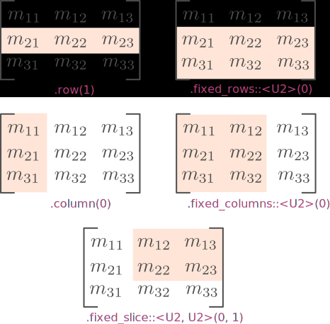
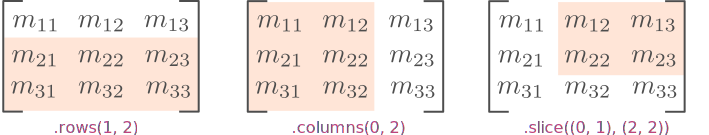
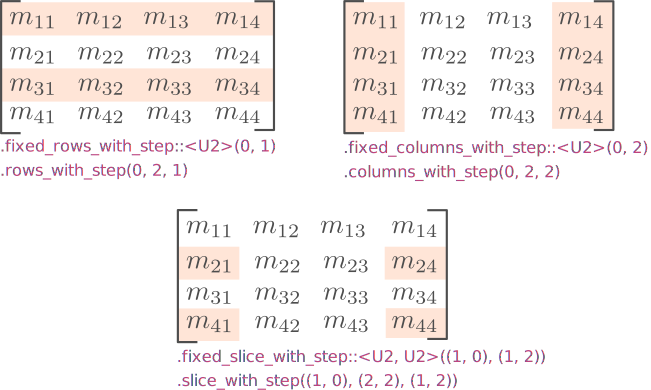
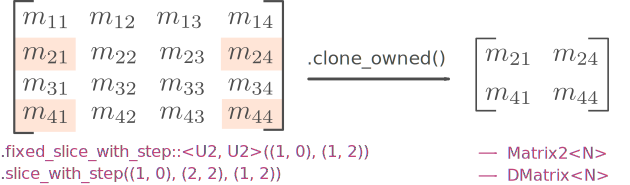
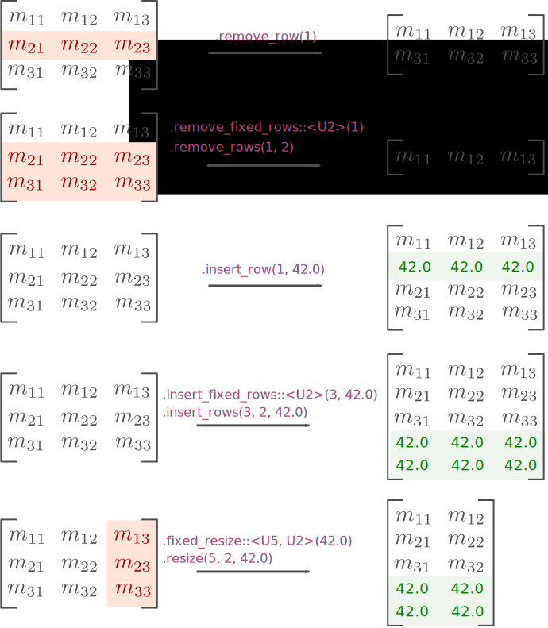

# Vectors and matrices
Vector and matrices are the fundamental building blocks of any linear algebra
library. Their sizes can either be known at compile-time or only at run-time.
In either case, they allow common operations (additions, multiplications, etc.)
to be used through operator overloading.

## The generic `Matrix` type
We first give a short description of the generic `Matrix` type. Readers
interested in the implementation details are refered to the section about
[implementation internals](../generic_programming/#implementation-internals).
In practice, most use-cases are covered by type aliases that hide the most
complicated type parameters.


The `Matrix<N, R, C, S>` type is a column-major matrix with a shape that may or
may not be known at compile-time. It takes four type parameters:

* `N`: the scalar type, i.e., the type of the matrix components. Typical values
  are `f32` or `f64`.
* `R`: a type characterizing the number of rows on this matrix.
* `C`: a type characterizing the number of columns on this matrix.
* `S`: the buffer that contains all the matrix components and (if necessary)
  metadata about its shape at run-time. Of all the type parameters, this is the
  only element actually instantiated by a `Matrix`.

The type parameters `R` and `C` completely determine whether or not the matrix
shape is known at compile-time or only at run-time. They can have two kinds of
values:

1. **Type-level integers:** because the Rust programming language does not
   support parametrization over integer values (yet), we have to simulate this
   feature using types instead of literals. For example, instead of writing
   `Matrix<N, 2, 4, S>` for a 2x4 matrix, we have to write `Matrix<N, U2, U4,
   S>`, where `U2` and `U4` are types exported by the root module of
   **nalgebra**, e.g., `use nalgebra::U2;`. Note that **nalgebra** only defines
   types from `U1` to `U127`.  If you need type-level integers greater than
   127, you have to grab them from the
   [typenum](https://docs.rs/typenum/1.5.1/typenum/) crate instead, e.g.
   `typenum::U1000`. Redefining `U1` to `U127` instead of using types from
   **typenum** right away was necessary to improve significantly the quality of
   error messages when matrices with incompatible dimensions are, say, added or
   multiplied.
2. **The special `Dynamic` type:** using this instead of a type-level integer
   indicates that the corresponding matrix dimension is not known at
   compile-time. For example, `Matrix<N, Dynamic, Dynamic, S>` has a number of
   rows and number of columns that can only be known at runtime. Another
   typical example is a dynamically-sized column vector: `Matrix<N, Dynamic,
   U1, S>`.

```
use na::{U2, U3, Dynamic, MatrixArray, MatrixVec};
use typenum::U1000;

// Statically sized and statically allocated 2x3 matrix using 32-bit floats.
type Matrix2x3f = Matrix<f32, U2, U3, MatrixArray<f32, U2, U3>>;

// Half-dynamically sized and dynamically allocated matrix with
// two rows using 64-bit floats.
type Matrix2xXf64 = Matrix<f64, U2, Dynamic, MatrixVec<f64, U2, Dynamic>>;

// Dynamically sized and dynamically allocated matrix with
// two rows and using 32-bit signed integers.
type DMatrixi32 = Matrix<i32, Dynamic, Dynamic, MatrixVec<i32, Dynamic, Dynamic>>;


// Statically sized and statically allocated 1000x3 matrix using 32-bit floats.
// Note that U1000 is imported from `typenum` while U3 comes from `nalgebra`.
type Matrix1000x3f = Matrix<f32, U1000, U3, MatrixArray<f32, U1000, U3>>;
```

Note that vectors are just type aliases for matrices. For a column vector
(resp. row vector), we simply use a matrix with `C` set to `U1` (resp. `R` set
to `U1`). Common low-dimensional matrices and vectors are exposed as type
aliases so that the user does not have to deal with anything but the scalar
type parameter `N`:

* `Vector1<N>` .. `Vector6<N>`: are column vectors of dimension 1 to 6.
* `Matrix1<N>` .. `Matrix6<N>`: are square matrices of dimension 1x1 to 6x6.
* Rectangular matrices have the form `MatrixIxJ<N>` where `I` and `J` are any
  value from 1 to 6, e.g., `Matrix4x5<N>`.
* `DVector<N>` and `DMatrix<N>`: are respectively a dynamically-sized column
  vector and a dynamically-sized matrix.

Internally, dynamically- and statically-sized matrices do not use the same data
storage type. While the former is always allocated on the heap using a `Vec`,
the latter prefers static allocation indirectly using a `GenericArray` from the
[generic-array](https://crates.io/crates/generic-array) crate. This distinction
is made possible by using different concrete types for the `S` type parameter
of the `Matrix` structure, depending on the values of the `R` and `C`
parameters for the matrix shape. See the section dedicated to [storage
buffers](../generic_programming/#storage-buffers) for more details.


## Matrix construction

All matrices and vectors with shapes known at compile-time can be created from
the values of their components given in conventional mathematical notation,
i.e., row-by-rows, using the usual `::new` method:

```rust
// A vector with three components.
let v = Vector3::new(1, 2, 3);

// A matrix with three lines and four columns.
// We chose values such that, for example, 23 is at the row 2 and column 3.
let m = Matrix3x4::new(11, 12, 13, 14,
                       21, 22, 23, 24,
                       31, 32, 33, 34);
```

Depending on the values of the `R` and `C` type parameters for the matrix
shape, the matrix construction methods listed below may have different
signatures. In particular, each constructor takes one `usize` parameter for
each matrix dimension that is set to `Dynamic`. Specifically:

* If `R` and `C` are both type-level integers, `::from_element(e)` takes only
  one parameter which is the element to fill the matrix with.
* If `R` is `Dynamic` and `C` a type-level integer, `::from_element(nrows, e)`
  takes two parameters: one for the number of matrix rows and one for the
  element to fill the matrix with.
* If `R` is a type-level integer and `C` is `Dynamic`, `::from_element(ncols,
  e)` takes two parameters: one for the number of matrix columns and one for
  the element to fill the matrix with.
* If both `R` and `C` are equal to `Dynamic`, then `::from_element(nrows,
  ncols, e)` takes three parameters: one for the number of matrix rows, one for
  the number of columns, and the last one for the element to fill the matrix
  with.

Method                          | Description
--------------------------------|------------
`::from_rows(...)`             | Creates a matrix filled with the given array of rows. Panics if any two rows provided do not have the same size. |
`::from_columns(...)`          | Creates a matrix filled with the given array of columns.  Panics if any two columns provided do not have the same size. |
`::from_diagonal(...)`         | Creates a diagonal matrix with its diagonal equal to the provided vector. All off-diagonal elements are set to `0`. |
`::repeat(...)`                | Creates a matrix filled with the given element (same as `::from_element(...)`).  |
`::from_element(...)`          | Creates a matrix filled with the given element (same as `::repeat(...)`).  |
`::from_iterator(...)`         | Creates a matrix filled with the content of the given iterator. The iterator must provide the matrix components in column-major order. |
`::from_row_slice(...)`        | Creates a matrix filled with the content of the given slice. Elements of the slice are provided in row-major order (which is the usual mathematical notation.) |
`::from_column_slice(...)`     | Creates a matrix filled with the content of the given slice. Elements of the slice are provided in column-major order.
`::from_fn(...)`               | Creates a matrix filled with the values returned by the given closure of type `FnMut(usize, usize) -> N`. This closure is called exactly once per matrix component and is given as parameter each matrix component's 0-based indices. |
`::identity(...)`              | Creates a matrix with `1` on its diagonal and `0` elsewhere. If the matrix to be constructed is not square, only the largest square submatrix formed by its first rows and columns is set to the identity matrix. All the other components are `0`. |
`::from_diagonal_element(...)` | Creates a matrix with its diagonal filled with the given element and `0` elsewhere. If the matrix to be constructed is not square, only the largest square submatrix formed by its first rows and columns is set to the identity matrix. All the other components are set to `0`. |
`::new_random(...)`            | Creates a matrix with all its components initialized at random using the default random generator of the `rand` crate, i.e., the `rand::random()` function. |


<ul class="nav nav-tabs">
  <li class="active"><a id="tab_nav_link" data-toggle="tab" href="#matrix_construction">Example</a></li>

  <div class="btn-primary" onclick="window.open('https://raw.githubusercontent.com/sebcrozet/nalgebra/master/examples/matrix_construction.rs')"></div>
</ul>

<div class="tab-content" markdown="1">
  <div id="matrix_construction" class="tab-pane in active">
```rust
// All the following matrices are equal but constructed in different ways.
let m = Matrix2x3::new(1.1, 1.2, 1.3,
                       2.1, 2.2, 2.3);

let m1 = Matrix2x3::from_rows(&[
    RowVector3::new(1.1, 1.2, 1.3),
    RowVector3::new(2.1, 2.2, 2.3)
]);

let m2 = Matrix2x3::from_columns(&[
    Vector2::new(1.1, 2.1),
    Vector2::new(1.2, 2.2),
    Vector2::new(1.3, 2.3)
]);

let m3 = Matrix2x3::from_row_slice(&[
    1.1, 1.2, 1.3,
    2.1, 2.2, 2.3
]);

let m4 = Matrix2x3::from_column_slice(&[
    1.1, 2.1,
    1.2, 2.2,
    1.3, 2.3
]);

let m5 = Matrix2x3::from_fn(|r, c| (r + 1) as f32 + (c + 1) as f32 / 10.0);

let m6 = Matrix2x3::from_iterator([ 1.1f32, 2.1, 1.2, 2.2, 1.3, 2.3 ].iter().cloned());

assert_eq!(m, m1); assert_eq!(m, m2); assert_eq!(m, m3);
assert_eq!(m, m4); assert_eq!(m, m5); assert_eq!(m, m6);

// All the following matrices are equal but constructed in different ways.
// This time, we used a dynamically-sized matrix to show the extra arguments
// for the matrix shape.
let dm = DMatrix::from_row_slice(4, 3, &[
    1.0, 0.0, 0.0,
    0.0, 1.0, 0.0,
    0.0, 0.0, 1.0,
    0.0, 0.0, 0.0
]);

let dm1 = DMatrix::from_diagonal_element(4, 3, 1.0);
let dm2 = DMatrix::identity(4, 3);
let dm3 = DMatrix::from_fn(4, 3, |r, c| if r == c { 1.0 } else { 0.0 });
let dm4 = DMatrix::from_iterator(4, 3, [
    // Components listed column-by-column.
    1.0, 0.0, 0.0, 0.0,
    0.0, 1.0, 0.0, 0.0,
    0.0, 0.0, 1.0, 0.0
].iter().cloned());

assert_eq!(dm, dm1); assert_eq!(dm, dm2);
assert_eq!(dm, dm3); assert_eq!(dm, dm4);
```
  </div>
</div>


Matrices with sizes known at compile-time also implement some construction
traits from the `num` crate at well:

Trait method            | Description
------------------------|------------
`Zero::zero()`          | Creates a matrix filled with zeros. |
`One::one()`            | Creates a matrix with a diagonal set to `1` and off-diagonal elements set to `0`. |
`Bounded::min_value()`  | Creates a matrix filled with the minimal value of the matrix scalar type. |
`Bounded::max_value()`  | Creates a matrix filled with the maximal value of the matrix scalar type. |


Column vectors (which are just `Matrix` with `C` set to `U1`) with low dimensions
from 1 to 6 have additional constructors:

* `::x()`, `::y()`, and `::z()` create a vector with, respectively, the first,
  second, or third coordinate set to `1` and all others to `0`.
* `::a()`, `::b()`, and `::c()` create a vector with, respectively, the fourth,
  fifth, or sixth coordinate set to `1` and all others to `0`.

```rust
assert_eq!(Vector3::x(), Vector3::new(1.0, 0.0, 0.0));
assert_eq!(Vector3::y(), Vector3::new(0.0, 1.0, 0.0));
assert_eq!(Vector3::z(), Vector3::new(0.0, 0.0, 1.0));

assert_eq!(Vector6::a(), Vector6::new(0.0, 0.0, 0.0, 1.0, 0.0, 0.0));
assert_eq!(Vector6::b(), Vector6::new(0.0, 0.0, 0.0, 0.0, 1.0, 0.0));
assert_eq!(Vector6::c(), Vector6::new(0.0, 0.0, 0.0, 0.0, 0.0, 1.0));
```

Adding a `_axis` suffix to those constructors, e.g., `::y_axis()`, will create
a unit vector wrapped into the `Unit`
[structure](../performance_tricks/#the-unit-wrapper). For example,
`Vector2::y_axis()` will create a `Unit<Vector2<N>>` with its the second
component of the underlying vector set to `1`.

```rust
assert_eq!(Vector4::x_axis().unwrap(), Vector4::x());
assert_eq!(Vector4::y_axis().unwrap(), Vector4::y());
assert_eq!(Vector4::z_axis().unwrap(), Vector4::z());

assert_eq!(Vector5::a_axis().unwrap(), Vector5::a());
assert_eq!(Vector5::b_axis().unwrap(), Vector5::b());
```

## Matrix operations
Operations between two matrices like addition, division, and multiplication,
require both matrices to have compatible shapes. In particular:

* Addition require both matrices to have the same number of rows **and** the
  same number of columns.
* Multiplication and division requires the matrix on the left-hand-side to have
  as many columns as the number of rows of the matrix on the right-hand-side.

Those restrictions are either checked at compile-time or at runtime, depending
on the inputs types. In particular, if the matrix dimensions to be checked are
type-level integers then the check is performed at compile-time. The following
shows an example of compilation error for attempting to multiply a 2x3 matrix
with a 4x4 matrix:

```rust
let a = Matrix2x3::zero();
let b = Matrix4::zero();
let _ = a * b; // Compile-time error here.
```

```rust
error[E0277]: the trait bound `na::constraint::ShapeConstraint: na::constraint::DimEq<na::U3, na::U4>` is not satisfied
  --> tests/matrix.rs:27:13
   |
27 |     let _ = a * b;
   |             ^^^^^ the trait `na::constraint::DimEq<na::U3, na::U4>` is not implemented for `na::constraint::ShapeConstraint`
   |
   = help: the following implementations were found:
   = help:   <na::constraint::ShapeConstraint as na::constraint::DimEq<D, D>>
   = help:   <na::constraint::ShapeConstraint as na::constraint::DimEq<D, na::Dynamic>>
   = help:   <na::constraint::ShapeConstraint as na::constraint::DimEq<na::Dynamic, D>>
   = note: required because of the requirements on the impl of `na::constraint::AreMultipliable<na::U2, na::U3, na::U4, na::U4>` for `na::constraint::ShapeConstraint`
   = note: required because of the requirements on the impl of `std::ops::Mul<na::Matrix<{float}, na::U4, na::U4, na::MatrixArray<{float}, na::U4, na::U4>>>` for `na::Matrix<{float}, na::U2, na::U3, na::MatrixArray<{float}, na::U2, na::U3>>`
```

If at least one matrix dimension to be checked is `Dynamic` then the check is
performed at run-time and panics in case of mismatch. The following example
shows the run-time error for attempting to multiply a statically-sized 2x3
matrix with a dynamically-sized 4x4 matrix:


```rust
let a = Matrix2x3::zero();
let b = DMatrix::from_element(4, 4, 0.0);
let _ = a * b; // Compiles fine but panics here.
```

```c
thread 'main' panicked at 'Matrix multiplication dimensions mismatch.', [...]/nalgebra/src/core/ops.rs:328
note: Run with `RUST_BACKTRACE=1` for a backtrace
```

The return type of a matrix operation is automatically deduced from the matrix
dimensions:

* If both matrices have dimensions known at compile-time then the result also
  has dimensions known at compile-time.
* If both matrices have dimensions known at run-time only then the result also
  has dimensions known at run-time.
* If one matrix has dimensions known at run-time and the other has dimensions
  known at compile-time then the result will have dimensions known at
  compile-time if they can be statically deduced from the arguments. For example,
  adding a `Matrix2x3` to a `DMatrix` will return a `Matrix2x3`. However,
  multiplying a `Matrix2x3` to a `DMatrix` will return a matrix with one
  dimension known at compile-time, and a second one known at run-time, i.e.,
  `Matrix<N, U2, Dynamic, S>` (where `N` and `S` are some types not detailed
  here). Indeed, the number of rows can be deduced from the first argument but
  the number of columns depends on the run-time value stored by the second
  argument.
  
```rust
let static_m  = Matrix2::zero();
let dynamic_m = DMatrix::from_element(2, 2, 0.0);

let static_v  = Vector2::zero();
let dynamic_v = DVector::from_element(2, 0.0);

// We know at compile-time that the sum will be a 2x2 matrix
// because of the first argument. The result is thus a `Matrix2`.
let static_plus_dynamic:  Matrix2<_> = static_m + dynamic_m;

// We don't know anything about the matrix dimensions at
// compile-time. The result is thus a `DMatrix`.
let dynamic_plus_dynamic: DMatrix<_> = dynamic_m + dynamic_m;

// The result is a static vector (even if the second argument
// has a dynamic size) because we know at compile-time that
// `static_m` has two rows and that `dynamic_v` has one column.
let static_times_dynamic: Vector2<_> = static_m * dynamic_v;

// The result is a dynamic vector because we do not know at
// compile-time its number of rows.
let dynamic_times_static: DVector<_> = dynamic_m * static_v;
```

## Matrix slicing
Matrix (and vector) slicing allows you to take a reference to a part of any
matrix.  Slicing a matrix does not perform any copy, move, or allocation of the
original matrix data. Instead, it stores a pointer to that data together with
some metadata about the slice size and strides. Note that taking a slice of a
matrix slice is allowed!

Because a matrix slice also has a type like `Matrix<N, R, C, S>` (with some
special value for the buffer `S`) it can usually be used just like a plain,
non-slice matrix besides three exceptions:

1. Methods that require a `&mut self` cannot be called on non-mutable slices.
2. Matrix slices cannot be created out of thin air using the methods shown in
   the [Matrix construction](#matrix_construction) section. One must already
   have an allocated matrix or another slice and use one of the dedicated
   methods shown thereafter.
3. Assignment operators do not work on any kind of slice, i.e., one cannot
   write `a *= b` if `a` even if `a` is a mutable matrix slice. This is
   actually a limitation of the current design of **nalgebra** that will be
   fixed in the future. Use `a.copy_from(&(a * b))` as a workaround.

There are three variations of matrix slicing methods. Mutable slices follow the
same semantics, except that the method names end with `_mut`:

* **"Fixed" slices:** slices with numbers of rows and columns known at
  compile-time. The name of the corresponding slicing methods usually start
  with the prefix `fixed_`.

Method                             | Description
-----------------------------------|------------
`.row(i)`                          | Reference to the i-th row of `self`. |
`.column(i)`                       | Reference to the i-th column of `self`. |
`.fixed_rows::<D>(i)`              | Reference to the submatrix with `D` consecutive rows of `self`, starting with the i-th. `D` must be a type-level integer. |
`.fixed_columns::<D>(i)`           | Reference to the submatrix with `D` consecutive columns of `self`, starting with the i-th. `D` must be a type-level integer. |
`.fixed_slice::<R, C>(irow, icol)` | Reference to the submatrix with `R` consecutive rows and `C` consecutive columns, starting with the `irow`-th row and `icol`-th column. `R` and `C` are type-level integers. |

<center>

</center>
----


* **"Dynamic" slices:** slices with numbers of rows and columns known at
  run-time only.

Method                 | Description
-----------------------|------------
`.rows(i, size)`       | Reference to `size` rows of `self`, starting with the i-th. |
`.columns(i, size)`    | Reference to `size` columns of `self`, starting with the i-th. |
`.slice(start, shape)` | Reference to the submatrix with `shape.0` rows and `shape.1` columns, starting with the `start.0`-th row and `start.1`-th column. `start` and `shape` are both tuples. |

<center>

</center>
----

* **Slices with strides:** fixed or dynamic slices that reference
  non-consecutive (but regularly spaced) rows and columns of the original
  matrix. The name of the corresponding slicing methods end with `_with_step`.

Method                                         | Description
-----------------------------------------------|------------
`.fixed_rows_with_step::<D>(i, step)`          | Reference to `D` non-consecutive rows of `self`, starting with the i-th. `step` rows of `self` are skipped between each referenced row. |
`.fixed_columns_with_step::<D>(i, step)`       | Reference to `D` non-consecutive columns of `self`, starting with the i-th. `step` columns of `self` are skipped between each referenced column. |
`.fixed_slice_with_steps::<R, C>(start, step)` | Reference to `R` and `C` non-consecutive rows and columns, starting with the component `(start.0, start.1)`. `step.0` (resp. `step.1`) rows (resp. columns) are skipped between each referenced row (resp. column). |
`.rows_with_step(i, size, step)`               | Reference to `size` rows of `self`, starting with the i-th. `step` rows are skipped between each referenced row. |
`.columns_with_step(i, size, step)`            | Reference to `size` columns of `self`, starting with the i-th. `step` columns are skipped between each reference column. |
`.slice_with_steps(start, shape, steps)`       | Reference to `shape.0` rows and `shape.1` columns, starting with the `(start.0, start.1)`-th component. `step.0` (resp. `step.1`) rows (resp. columns) are skipped between each referenced row (resp. column). |

<center>

</center>

Note that the method `.clone_owned()` may be used to create a plain matrix from
a slice, i.e., actually copying the referenced components into a new matrix
structure that owns its data. Whether or not the result of this cloning is a
dynamically- or statically-sized matrix depends on the kind of slice.
Fixed slices will yield a statically-sized matrix while dynamic slices yield
a dynamically-sized matrice.

<center>

</center>

## Matrix resizing
The number of rows or columns of a matrix can be modified by adding or removing
some of them. Similarly to [slicing](#matrix-slicing), two variants exist:


* **"Fixed resizing"** where the number of rows or columns to be removed or
  inserted are known at compile-time. This allows the compiler to output a
  statically-sized matrix when the input is also statically-sized.

Method                               | Description
-------------------------------------|-------------
`.remove_row(i)`                     | Removes the i-th row.
`.remove_column(i)`                  | Removes the i-th column.
`.remove_fixed_rows::<D>(i)`         | Removes `D` consecutive rows, starting with the i-th.
`.remove_fixed_columns::<D>(i)`      | Removes `D` consecutive columns, starting with the i-th.
`.insert_row(i, val)`                | Adds one row filled with `val` at the i-th row position.
`.insert_column(i, val)`             | Adds one column filled with `val` at the i-th row position.
`.insert_fixed_rows::<D>(i, val)`    | Adds `D` consecutive rows filled with `val` starting at the i-th row position.
`.insert_fixed_columns::<D>(i, val)` | Adds `D` consecutive columns filled with `val` starting at the i-th column position.
`.fixed_resize::<R2, C2>(val)`       | Resizes the matrix so that it contains `R2` rows and `C2` columns. Components are copied such that `result[(i, j)] == input[(i, j)]`. If the result matrix has more rows or more columns, then the extra components are initialized to `val`.

----

* **"Dynamic resizing"**  where the number of rows or columns to be removed or
  inserted are not known at compile-time. The result matrix will always be
  dynamically-sized (the affected dimension-related type parameter of
  `Matrix<...>` is set to `Dynamic`).

Method                       | Description
---------------------------- |-------------
`.remove_rows(i, n)`         | Removes `n` rows, starting with the i-th.
`.remove_columns(i, n)`      | Removes `n` columns, starting with the i-th.
`.insert_rows(i, n, val)`    | Inserts `n` rows filled with `val` starting at the i-th row position.
`.insert_columns(i, n, val)` | Inserts `n` columns filled with `val` starting at the i-th row position.
`.resize(new_nrows, new_ncols, val)` | Resizes the matrix so that it contains `new_nrows` rows and `new_ncols` columns. Components are copied such that `result[(i, j)] == input[(i, j)]`. If the result matrix has more rows or more columns, then the extra components are initialized to `val`.

The implicit `self` argument of those methods is always consumed in order to
re-use the input data storage to construct the output. Fixed resizing should be
preferred whenever the number of rows/columns to be inserted or removed is
known at compile-time.

It is strongly recommended to use fixed resizing whenever possible, especially
when the matrix being resize has a size known at compiletime (and is thus
statically allocated). Indeed, dynamic resizing will produce heap-allocated
results because the size of the output matrix cannot be deduced at
compile-time.

<center>

</center>
